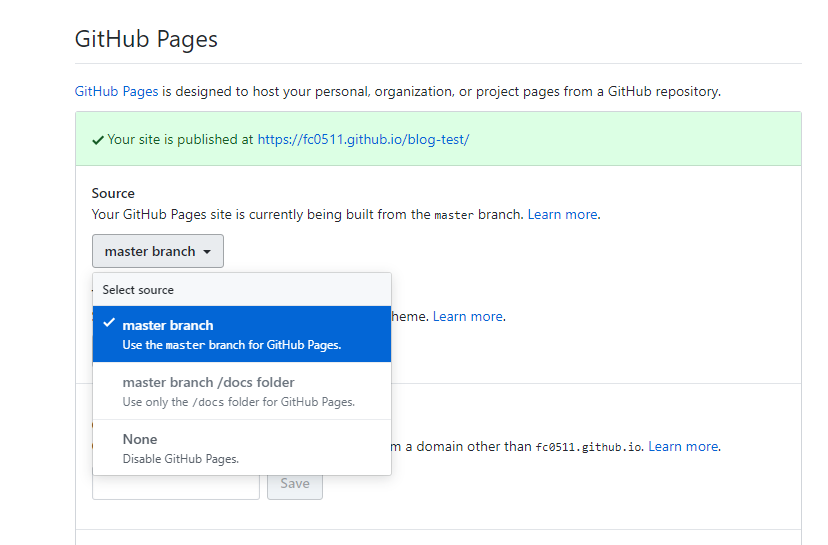

在GitHub提交的代码，如果想要在线预览页面，我们可以使用GitHub提供的GitHub Pages功能

## 1.登入 GitHub，新建一个 repo

## 2.进入[setting]进行设置

## 3.找到GitHub Pages，开启 GitHub Pages 功能，得到一个「预览地址」

第一步：选择master 分支。

第二步：点击save，进行保存。

## 4.访问页面

如果你要看预览这个仓库中其它的文件可以在仓库地址后面加上你要的文件路径
如：https://github.com/FC0511/blog-test/index.html