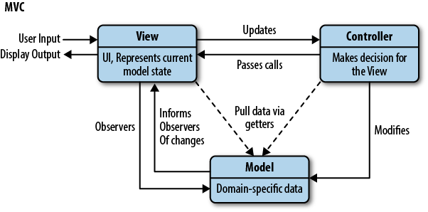

### MVC
 M 是 Model，数据模型，负责数据相关的任务  
 V 是 View，视图，负责用户界面  
 C 是 Controller，控制器，负责监听用户事件，然后调用 M 和 V 更新数据和视图
 
 
 
 
 ### EventBus
 一种设计模式或框架，主要用于组件/对象间通信的优化简化。
 ```
import $ from 'jquery'

class EventBus {
  constructor() {
    this._eventBus = $(window)
  }
// 绑定事件  
  on(eventName, fn) {
    return this._eventBus.on(eventName, fn)
  }
// 触发事件
  trigger(eventName, data) {
    return this._eventBus.trigger(eventName, data)
  }
// 解绑事件
  off(eventName, fn) {
    return this._eventBus.off(eventName, fn)
  }
}

export default EventBus
```

### 表驱动编程
将重复的内容通过哈希表抽离出来，利用循环事件功能的重复利用。减少了重复代码，提高了程序的可读性。

### 模块化
将一个功能封装成几个块(文件), 进行组合在一起，块的内部数据是私有的, 只是向外部暴露一些接口(方法)与外部其它模块通信。好处：避免命名冲突、高复用性和可维护性、解耦。