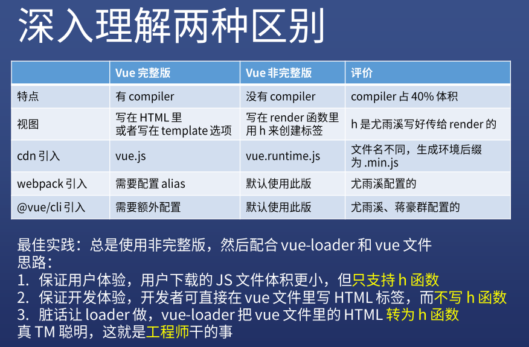

#### Vue有两个不同的版本，它们分别是Vue完整版（vue.js）和Vue非完整版（vue.runtime.js）
特点：  
完整版有compiler（编译器用来将模板字符串编译成为 JavaScript 渲染函数的代码），这导致完整版体积更大。

非完整版没有compiler的，所以体积更小，要比完整版体积小大概30%。
视图： 
完整版的视图是写在HTML里或template选项的，由于有 compiler(编译器)的存在，完整版运行时：用来创建 Vue 实例、渲染并处理虚拟 DOM 等的代码。基本上就是除去编译器的其它一切。

非完整版的视图是鞋子啊render里的，是用h函数来创建标签。非完整版运行时：当使用 vue-loader 或 vueify 的时候，*.vue 文件内部的模板会在构建时预编译成 JavaScript。你在最终打好的包里实际上是不需要编译器的，所以只用运行时版本即可。



#### template 和 render 的区别
```
new Vue({
  template: '<div>{{ hi }}</div>'
})

new Vue({
  render (h) {
    return h('div', this.hi)
  }
})
```
#### 如何用 codesandbox.io 写 Vue 代码
codesandbox.io是一个在线编辑器，能够快速创建项目。点击中间按钮Create a Sandbox, it’s free，创建项目，选中vue开始编辑即可。
（注意：不要登录，否则只能创建50个项目）